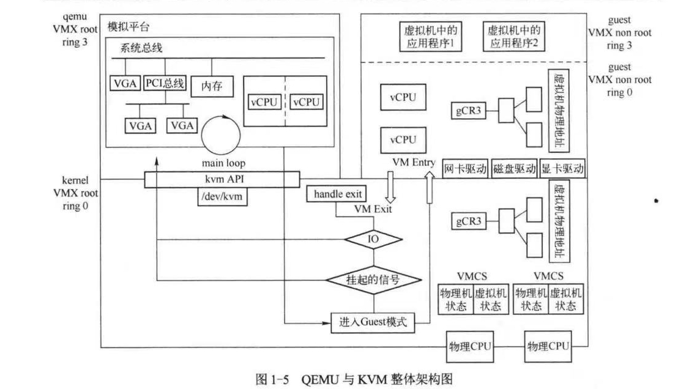

# 第一章 概述

## 1. QEMU与KVM架构
- KVM的具体设计和实现可以查看[参考论文][KVM]
  
- KVM：基于内核的虚拟机，简称kvm，是一个新的Linux子系统，它利用了这些虚拟化扩展指令，将虚拟机监控器（VMM——也被称作hypervisor）的功能加入到Linux中。
  > VMM： Virtual Machine Monitor, VMM之于虚拟机就如同操作系统之于进程。
- QEMU是一个模拟器（类似VMare Workstation）,KVM将QEMU作为应用层组件，共同构成了QEMU-KVM架构。
  >KVM本身是一个内核模块，导出了一些列接口到用户空间，用户空间可以使用这些接口创建虚拟机。
-  Machine Emulator（机器仿真器）和 Virtualizer（虚拟化器）的区别
  1. 机器仿真器：
     - 功能：机器仿真器通过完全模拟计算机硬件的每一个细节来运行不同的操作系统或软件环境。它可以使得一个计算机系统在完全不同的硬件架构上运行。例如，在x86架构的机器上运行ARM架构的操作系统。
     - 性能：由于需要模拟所有的硬件操作，仿真器通常比实际硬件要慢得多。
      - 应用场景：主要用于开发、测试、调试和运行与主机硬件架构不兼容的软件。例如，开发移动应用时，可以使用Android Emulator在PC上模拟ARM架构的设备。
  2. 虚拟化器：
     - 功能：虚拟化器通过在宿主机的硬件上直接运行多个虚拟机，而无需完全仿真硬件。虚拟化器通常依赖于宿主机的CPU硬件虚拟化技术（如Intel VT-x或AMD-V）来提高性能。虚拟化器允许在同一硬件上运行多个操作系统，前提是这些操作系统与宿主机的硬件架构兼容。
      - 性能：因为虚拟化器直接使用宿主机的硬件资源，性能开销较小，接近原生运行速度。
      - 应用场景：广泛应用于服务器虚拟化、云计算、桌面虚拟化等场景，如在一台物理服务器上运行多个虚拟机，每个虚拟机可以运行不同的操作系统。
  3. 总结：
   机器仿真器：用于在不同架构之间运行不兼容的操作系统或软件，性能较低。
  虚拟化器：用于在相同或兼容硬件架构上运行多个操作系统，性能接近原生。
- 完整架构图如下图所示：
  
>左边上半部分列出了QEMU的主要任务：
>1. 初始化时创建模拟的芯片组
>2. 创建CPU线程
>3. 分配地址空间作为虚拟机的物理地址
>4. 为虚拟机创建用户指定的虚拟设备

>右边上半部分表示的是虚拟机的运行（虚拟机本身的运行过程）：QEMU和KVM对于虚拟机而言完全透明
> - 虚拟机的一个cpu对应QEMU进程中的一个线程（QEMU作为模拟平台可以包含多个虚拟机）

>下半部分表示的是位于linux内核中的KVM驱动。 

1. **CPU虚拟化**
  - QEMU创建虚拟机CPUI线程，调用KVM接口将虚拟机运行起来
  - KVM截取虚拟机中的敏感指令的操作如下图所示：
  
  - KVM使用名为VMCS的结构来保存虚拟机VM Exit 和 VM Entry的状态。
1. **内存虚拟化**
   - QEMU初始化时调用KVMN接口，告知KVM虚拟机所需要的内存
   - QEMU在不断更新内存布局的过程中会**持续**调用KVM接口通知内核KVM模块虚拟机的内存分布。
   - [EPT][EPT参考]（Exatended Page Table, 拓展页表）。EPT地址转换原理如图所示：
    
2. **设备虚拟化**
  - SRIOV（Single Root I/O Virtualization,单根输入/输出虚拟化），SRIOV能够将单个的物理硬件高效地虚拟出多个虚拟硬件
    
3. **中断虚拟化**
  - QEMU支持单CPU大额2INTEL 8259中断控制器以及SMP的I/O APIC和LAPIC中断控制器。(KVM自己也实现了)
  

## 2.KVM API调用实例

1. 之所以将QEMU和KVM联系起来，是因为KVM创立之初重用了QEMU的设备模拟部分。
2. KVM的ioctl接口：
   1. 系统全局ioctl：作用对象是KVM本身，比如一些全局配置项，创建虚拟机的ioctl也在其中。
   2. 虚拟机相关的ioctl：作用对象为一台虚拟机，比如设置虚拟机的内存布局，创建虚拟机的VCPU。
   3. 虚拟机VCPU的ioctl：作用对象是一个虚拟机的VCPU，比如开始虚拟机VCPU的运行。
---
>简要复习一下计组中的诸多寄存器：
>1. 段寄存器：段寄存器是因为对内存的分段管理而设置的。计算机需要对内存分段，以分配给不同的程序使用。在描述内存分段时，需要有如下段的信息：1.段的大小；2.段的起始地址；3.段的管理属性（禁止写入/禁止执行/系统专用等）。需要用8个字节（64位）存储这些信息，但段寄存器只有16位，因此段寄存器中只能存储段号（segment selector，也译作“段选择符”），再由段号映射到存在内存中的GDT（global (segment) descriptor table，全局段号记录表），读取段的信息。
>2. 控制寄存器：例如用于控制当前CPU运行状态或者运算状态的寄存器。比如CPSR寄存器用于可以用于控制CPU当前所处工作模式，以及保存运算时的进位状态。
>3. CS：CS寄存器保存了当前执行代码段的段基地址。段基地址是一个内存地址，用于标识代码段在内存中的起始位置。
>4. IP: CS寄存器与指令指针（IP）寄存器共同作用，用于指示下一条要执行的指令的位置。CS寄存器包含代码段的基地址，而IP寄存器包含段内偏移，这两个寄存器的组合确定了下一条指令的内存地址

[EPT参考]:https://blog.csdn.net/huang987246510/article/details/104650146?ops_request_misc=%257B%2522request%255Fid%2522%253A%2522172102872716800180686952%2522%252C%2522scm%2522%253A%252220140713.130102334..%2522%257D&request_id=172102872716800180686952&biz_id=0&utm_medium=distribute.pc_search_result.none-task-blog-2~all~sobaiduend~default-1-104650146-null-null.142^v100^pc_search_result_base9&utm_term=ept%20%E7%89%A9%E7%90%86%E9%A1%B5%E6%9E%84%E9%80%A0&spm=1018.2226.3001.418

[KVM]:https://www.kernel.org/doc/ols/2007/ols2007v1-pages-225-230.pdf

