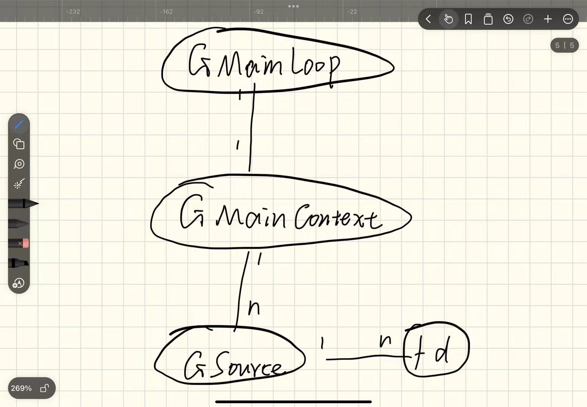
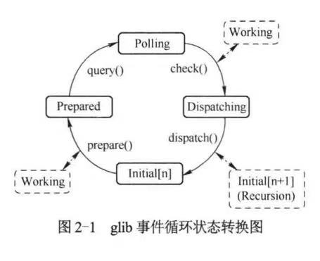

# QEMU基本组件
## 1.qemu事件循环机制
 - fd（文件描述符）：
  是进程对打开文件的抽象，它是操作系统为每个打开的文件分配的句柄，用于在进程中访问文件。
    > fcb（进程控制块）：是文件系统层面的数据结构，存储文件的详细信息，描述文件的物理存储信息。fcb是一个**数据结构**，而fb是一个**整数值**。
  - vnc（Virtual Network Computing）是一种远程控制协议：允许用户通过网络访问和控制另一个计算机的桌面。通过VNC，用户可以在一台计算机上实时查看并操作另一台计算机的桌面环境，类似于远程桌面连接。
    >VNC事件源是QEMU在启用VNC服务器时的后台机制，它负责处理鼠标点击、键盘输入等远程操作。这些事件会被传送到虚拟机内部，使用户能够远程控制虚拟机的桌面环境。
  - ppoll 是 Linux 下的一个函数，用于等待文件描述符的状态变化（如可读、可写或出现错误）。
    >ppoll会设置一个最大等待时间
  - qemu主循环中的timeout：
    1. main_loop_wait 中的 timeout：处理定时器事件，确保 QEMU 能够及时响应和执行。
    2. glib_pollfds_fill 中的 timeout：对fd的监听事件，确保 QEMU 在适当的时间内检查是否有 I/O 事件需要处理。
    > 两个 timeout 会相互比较，取较小的一个作为主循环的最大阻塞时间，即主循环在这段时间内最多等待多长时间后必须重新检查事件。
## 2. QEMU线程模型
  1. 一个 QEMU进程代表一个虚拟机。QEMU会有若干个线程，例如：一个CPU会有一个线程、VNC线程、I/O线程等
  > 这里提到的进程和线程都是对应于QEMU宿主机的。
  > 名词解释：
  > BQL： Big QEMU Lock，是 QEMU 用来保护全局状态的一个大锁（big lock）。
  > VNC: Virtual Network Computing是一种远程桌面共享协议和软件，它允许用户通过网络控制和访问另一台计算机的桌面。**在虚拟化平台（如 QEMU）中**，VNC 常用作虚拟机的图形化管理工具。通过 VNC，管理员可以查看和控制虚拟机的桌面界面，方便虚拟机的监控和操作。
  2. QEMU参数解析：
  ```
  typedef struct QEMUOption{
    const char *name;   //参数选项名称
    int flags;          //参数选项属性，比如是否有子参数
    int index;
    uint32_t arch_mask; //参数支持的体系结构
  }QEMUOption;
  ```
  vl.c在全局范围定义了一个 qemu options，不在qemu options 中的参数是不合法的。

## 3.glib事件循环机制
- glib事件循环机制通过一个**主循环**来处理各种**事件**
  - **事件**通过**事件源**来描述
  > **事件源**包括：fd、超时和idle事件等，每种事件源都有一个优先级
  > gLib 中的 **idle 事件** 是一种特殊的事件源，用于在事件循环中 系统空闲时执行的任务。(有点像进程调度中的空进程)

- glib事件循环中的几个重要的结构体
  1. GMainLoop:  表示一个事件循环，对应一个GMainContext
  2. GMainContext：一个GMainContext关联多个Gsource
  3. GSource：表示事件源，每一个Gsource可以关联多个fd,每个GSource关联到一个GMainContext。
  >三者的关系如下图：[tupian1]
  >**GMainLoop**：是事件循环的**控制者**，负责启动、停止和循环运行。
  >**GMainContext**：是事件循环的**管理者**，负责追踪和调度多个 GSource 事件源。
  >**GSource**：是事件的**触发源**，提供具体的事件类型和条件，供 GMainContext 检查和执行。
  >三者的层次关系大致如图所示：


- 下图是一次**主循环GMainLoop**的过程

  

  1. **Prepare**：准备阶段
     - 作用：在这一阶段，主上下文 (GMainContext) 会检查所有已注册的事件源（GSource），看看是否有事件源准备好立即处理，或者是否需要等待一段时间（比如超时事件）才会触发。
     - 结果：如果有事件源已经准备好立即处理，则设置一个标记，让循环知道可以立即处理事件而无需等待。
  2.  **Query**：查询阶段
      - 作用：Query 阶段会计算出事件循环在当前轮次中需要等待的时间。例如，如果有定时器事件在接下来的一段时间内触发，这一阶段会返回一个等待时间，让事件循环在特定的时间内休眠。
      - 结果：得到一个等待时间（超时时间），该时间用于决定是否在 check 阶段中等待外部事件（如文件描述符的变化）或立即进入 dispatch 阶段。
  3. **Check**：检查阶段
     - 作用：在 Check 阶段，事件循环会检查系统底层（如文件描述符）的状态，看看是否有任何外部事件准备好处理。如果在 prepare 阶段发现没有立即可处理的事件源，则在此阶段等待超时时间（来自 query 阶段）。
     - 结果：确认哪些事件源已就绪，可以进入下一步的 dispatch 阶段来处理这些事件。
  4. **Dispatch**：分发阶段
     - 作用：在 Dispatch 阶段，事件循环会调用已经准备好的事件源的回调函数，处理相应的事件（如 I/O 事件、定时器事件、空闲事件等）。
     - 结果：所有已就绪的事件源被处理，触发的回调函数被执行。Dispatch 完成后，进入下一个循环迭代。